# AI - Robot Vacuum Agent Analysis
##### Seattle University - Artificial Intelligence 5068 - Data Translation Challenge March 2021
##### Author: Jennifer Grosz

## Business Problem:
SuckyCorp is havily relying on this analyses which will lead to product decisions involving their ever-expanding line of robot vacuum agents.  This project summarizes product tradeoffs for the whole Sucky line of agents and provides recommendations as to what products should be supported and which should not. The data for analysis was collected by running the candidate agents in the simulation testbed and recording their scores; the experiments were ran over a range of environmental conditions. The report additionally identifies whether or not the conclusions found depend on the environment, and if so, how.  

This analysis is based on the data collected from 100 tests for every combination of varying Wall and Dirt environments for each of the four Sucky models. Over all environments evaluated in this analysis, the following is a ranked order of performance from best to worst:

  1. Omniscient Sucky
  2. Memory Sucky
  3. Sensing Sucky
  4. Non-Sensing Sucky

In regard to the popular Memory Sucky Model, the following are my findings on the effect of raising and lowering the model’s battery capacity:
  - On average and in general increasing battery capacity increases the model’s performance and decreasing the battery capacity decreases the model’s performance.
  - However, in environments with low dirt and high walls, I found the previous statement does not
hold as increasing the battery capacity to 1500 resulted in 5% better average performance scores than increasing the battery capacity to 2000.

## SUPPORTING ANALYSIS
For the first objective, determining how the expected scores compare across varying environmental conditions, I analyzed each model relative to the Non-Sensing Sucky model which is used as the benchmark for my analysis. The significant results of the linear regression analysis are as follows:

  - The Sensing Sucky model scores an average of 69 points higher than the Non-Sensing Model, which is a total average score of 94 points. This model improved total average scores by 275% but improvement was down 60% from the top scoring model, Omniscient Sucky.
  - The Memory Sucky model scores an average of 122 points higher than the Non-Sensing Model, which is a total average score of 147 points. This model improved total average scores by 486%
but improvement was down 30% from the top scoring model, Omniscient Sucky.
  - The Omniscient Sucky model scores an average of 173 points higher than the Non-Sensing Model,
which is a total average score of 198 points. This model improved total average scores by 690%.

Figure 1.A presents a visual representation of total average scores per agent calculated over all environmental conditions. Figure 1.B provides a breakdown of improvement for each model as well as the difference of improvement from the Sensing Sucky and Memory Sucky models compared to the Omniscient Sucky model which was the overall top performing model.

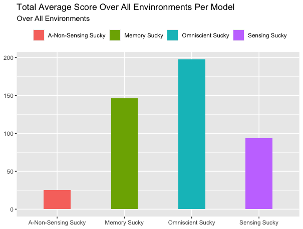

_Figure 1.A_

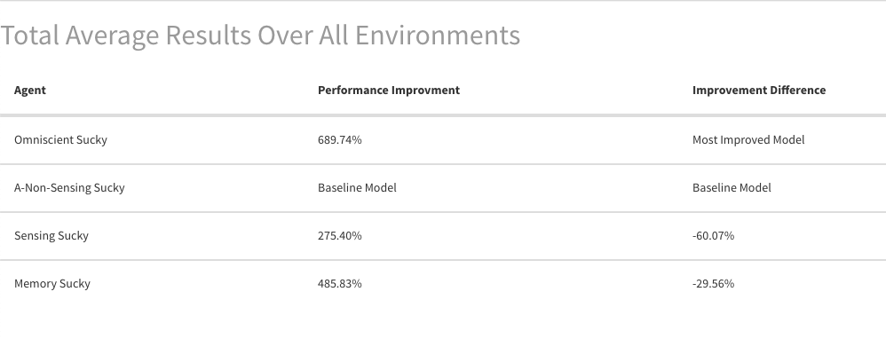

_Figure 1.B_

To present a better understanding of how each agent performs, I’ve included the below figures which show how each agent comparatively performs under the extreme environmental conditions: high dirt, low walls and low dirt, high walls. The results are as follows:

  - The Sensing Sucky model improved average scores in conditions with high dirt and low walls by 309% but improvement was down 40% from the top scoring model, Omniscient Sucky.
  - The Memory Sucky model improved average scores in conditions with high dirt and low walls by 487% and improvement was down only 4% from the top scoring model, Omniscient Sucky.
  - The Omniscient Sucky model improved average scores in conditions with high dirt and low walls by 507%.
  
Figure 2.A and Figure 2.B below provide visual representations of these results for average scores per battery capacity tested over all environments with high dirt and low walls.
 
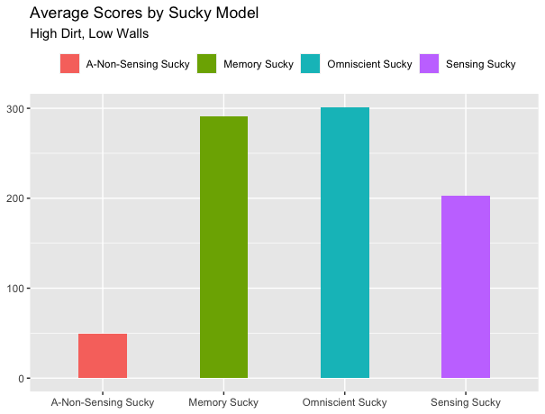

_Figure 2.A_

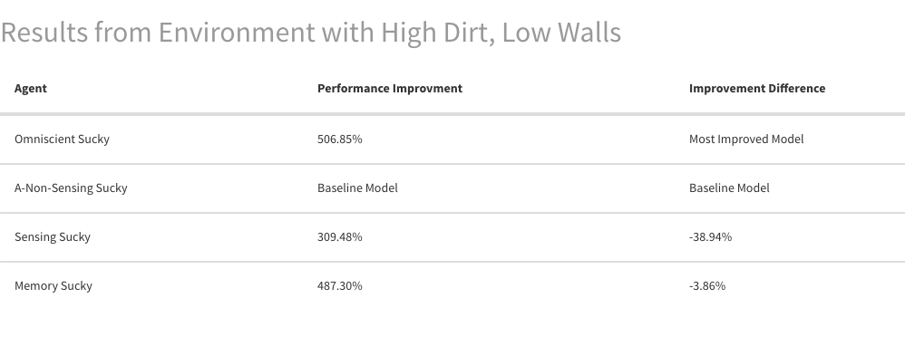

_Figure 2.B_

  -The Sensing Sucky model improved average scores in conditions with low dirt and high walls by 209% but improvement was down 81% from the top scoring model, Omniscient Sucky.

  - The Memory Sucky model improved average scores in conditions with low dirt and high walls by 441% and improvement was down 62% from the top scoring model, Omniscient Sucky.
  - The Omniscient Sucky model improved average scores in conditions with low dirt and high walls by 1089%.
  
Figure 3.A and Figure 3.B below provide visual representations of these results for average scores per battery capacity tested over all environments with low dirt and high walls.
 
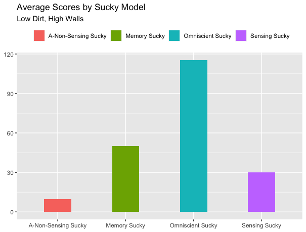

_Figure 3.A_

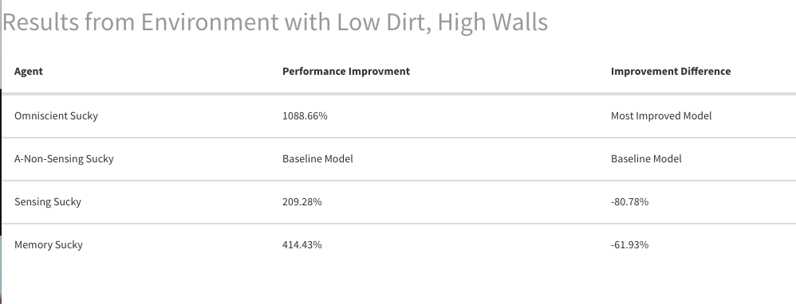

_Figure 3.B_

For the second objective, determining the effect of raising and lowering the battery capacity for the Memory Sucky model, I analyzed average score per environment for Memory Sucky models with battery capacities of 250, the standard 500, 1000, 1500 and 2000. Maintaining the battery capacity at its current level, 500, was used as the baseline for my analysis. The significant results of the linear regression analysis are as follows:

  - With a battery capacity of 1000 the model scores a total average of 247 points. Increasing the battery capacity to this level improved total average scores by 62%, but this improvement was down 50% from the top performing battery capacity.
  - With a battery capacity of 1500 this model scores a total average score of 303 points. Increasing the battery capacity to this level improved total average scores by 98%, but this improvement was down 21% from the top performing battery capacity.
  - With a battery capacity of 2000, the model scores a total average of 342 points. Increasing the battery capacity to this level showed the greatest improvement in total average scores by boosting scores by 124%
  - The result from lowering the battery capacity to 250 was not statistically significant, but from my analysis I found that lowering the battery capacity to this level decreases total average scores by 48% which is a performance decrease of 138% from the top performing battery capacity.
  
Figure 4.A and Figure 4.B below provide visual representations of these results for total average scores per battery capacity tested over all environmental conditions.
 
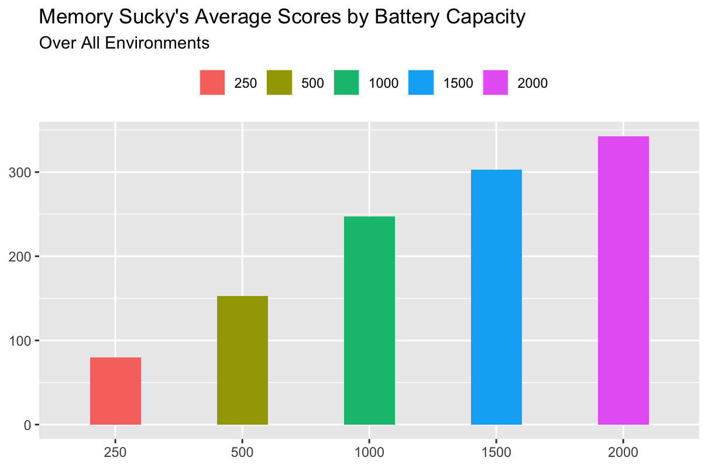

_Figure 4.A_

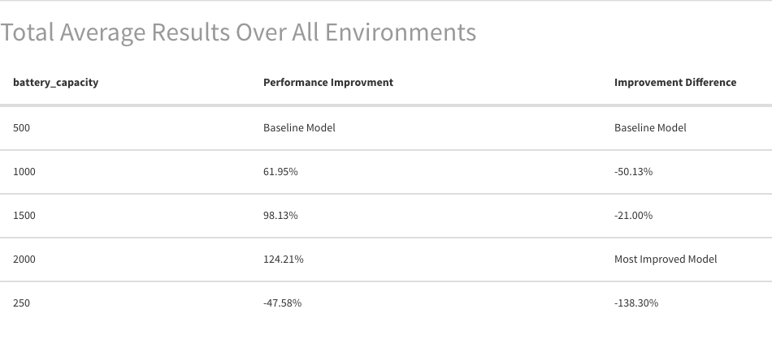

_Figure 4.B_

Similar to my analysis for objective one, I have conducted the following additional analysis to show how each battery capacity comparatively performs under the extreme environmental conditions: high dirt, low walls and low dirt, high walls. The results are as follows:

  - With the battery capacity lowered to 250 this model decreased average scores in conditions with high dirt and low walls by 42% which is down 145% from the top performing battery capacity.
  - With the battery capacity increased to 1000 this model improved average scores in conditions with high dirt and low walls by 60% but this improvement was down 36% from the top performing battery capacity.
  - Increasing the battery capacity to 1500 showed the greatest improvement in average scores for
conditions with high dirt and low walls by boosting scores by 94%.
  - With the battery capacity increased to 2000 this model improved average scores in conditions
with high dirt and low walls by 89% but this improvement was down 5% from the top performing battery capacity.

Figure 5.A and Figure 5.B below provide visual representations of these results for average scores per battery capacity tested over all environments with high dirt and low walls.
 
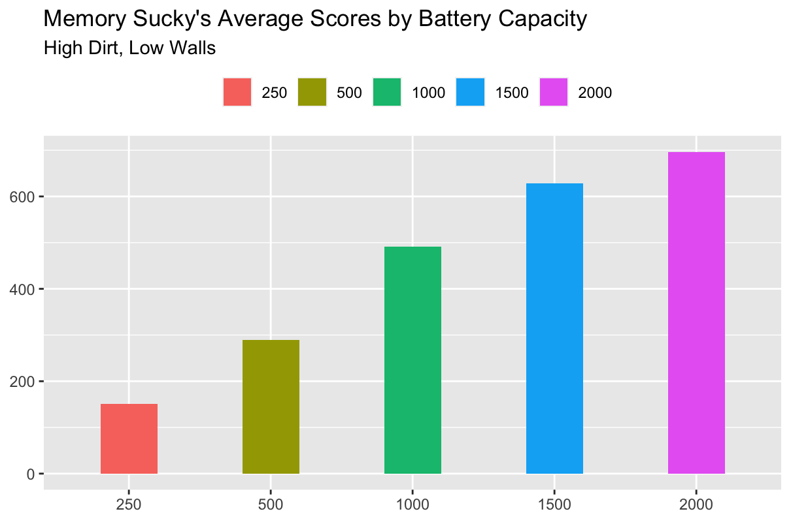 

_Figure 5.A_

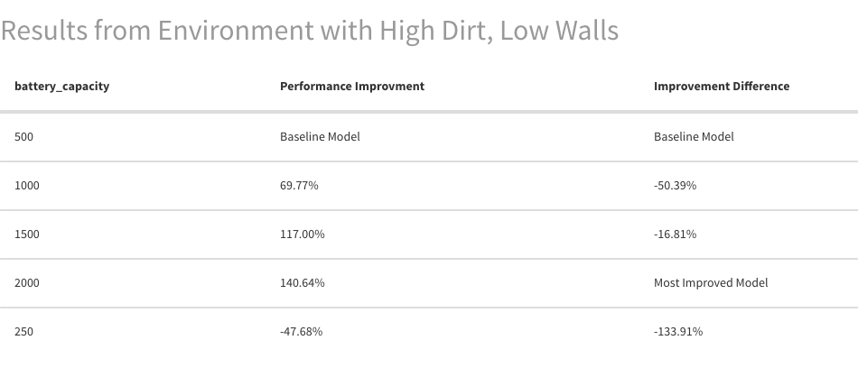

_Figure 5.B_

  - With the battery capacity lowered to 250 this model decreased average scores in conditions with low dirt and high walls by 48% which is down 134% from the top performing battery capacity.
  - With the battery capacity increased to 1000 this model improved average scores in conditions
with low dirt and high walls by 70% but this improvement was down 50% from the top
performing battery capacity.
  - With the battery capacity increased to 1500 this model improved average scores in conditions
with low dirt and high walls by 117% but this improvement was down 17% from the top
performing battery capacity.
  - Increasing the battery capacity to 2000 showed the greatest improvement in average scores for
conditions with low dirt and high walls by boosting scores by 141%.

Figure 6.A and Figure 6.B below provide visual representations of these results for average scores per battery capacity tested over all environments with low dirt and high walls.

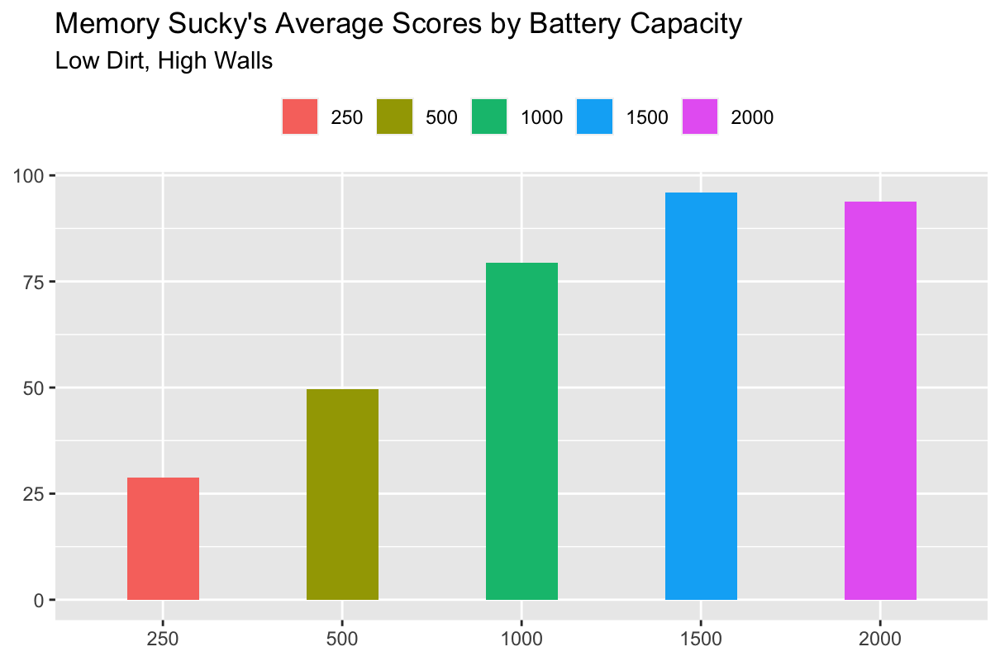 

_Figure 6.A_

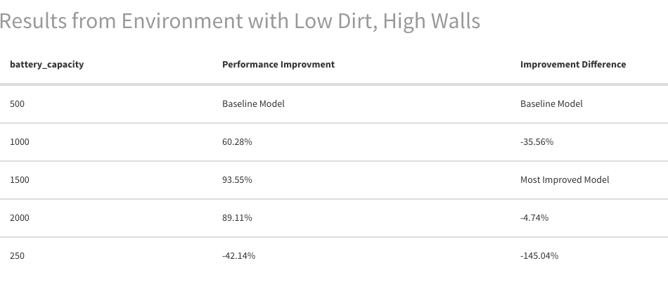

_Figure 6.B_

## CONCLUSION
In terms of performance under varying conditions, the Omniscient Sucky model performs the best across the board. However, Memory Sucky comes in at a close second when evaluating performance under high dirt and low wall environmental conditions and is consistently the second-best performing model across all other tests performed.

 It is my recommendation, based on this score-performance analysis, that both the Omniscient Sucky and Memory Sucky should be Sucky models included in SuckyCorp’s line of Vacuum Agents as their performance data generated through this analysis speaks for itself – both of these Sucky models significantly and consistently outperform the Sensing Sucky and the Non-Sensing Sucky models. Additionally, this pair of models are ensured to do what customers expect SuckyCorp products to provide: top of the line vacuum agents who will suck up dirt and ensure workplaces are free of dirt.
 
The Memory Sucky model makes for a perfect high-performance, lower-cost alternative option to the top-of-the-line Omniscient Sucky model, as this model still produces excellent performance scores without the high fixed costs associated with the required installation of sensors at the customer’s site. If you were to drop one model from this line of products, I would recommend discontinuing Non-Sensing Sucky. This model underperforms across all varying environmental conditions and has the potential to leave customers dissatisfied with their purchase due to lack of performance. Instead of the Non-Sensing Sucky model, I would recommend keeping the Sensing Sucky model in your line of products as the lowest- cost, lowest-performance-tier agent in your vacuum product offerings. Comparatively, the Sensing Sucky does not do a poor job under high dirt, low wall conditions and its performance is 309% better than the Non-Sensing Sucky model under those same environmental conditions.

With that said, if it is your intention to identify a method for improving Memory Sucky’s performance, it would be my recommendation to improve that model’s battery capacity as my tests have provided evidence that increasing battery capacity has a direct effect on improving this Sucky model’s performance. The graph shown as Figure C of the appendix is representative of the increasing relationship between battery capacity and total average score. In order to definitively determine at what level Memory Sucky’s battery capacity should be increased to, further analysis is required to account for the cost of increasing the battery capacity as well as the cost associated with manufacturing the Omniscient Sucky model. It would be a good next step for SuckyCorp. to determine at what level Memory Sucky outperforms even the Omniscient Sucky model, but in order to make a definitive statement about this the analysis would require cost information associated with each of these Models and the battery capacity enhancements.

## APPENDIX
Figure A. is the output generated from the linear regression model used to determine the causal effect of
each agent on average score.

Model1: lm(averageScore ~ Agent, simResults)

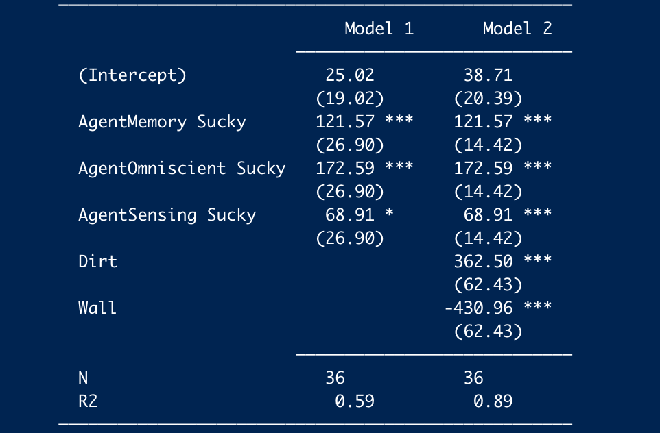

_Figure A_

Figure B. is the plotted residuals from Model2 showing each agent’s effect on average score.

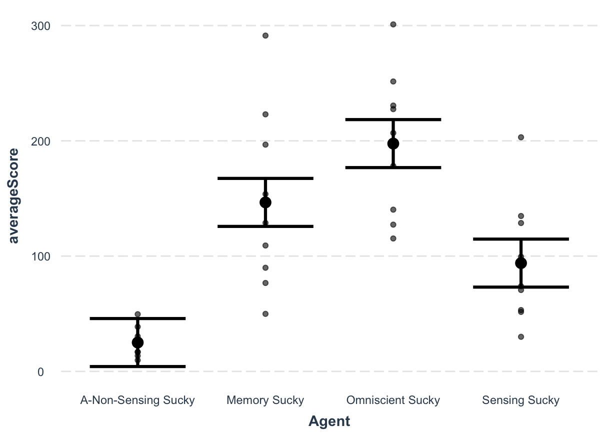

_Figure B_

Figure C. is the output generated from the linear regression models used to determine the causal effect
of varying battery capacities on Memory Sucky’s average score. 

Model2: lm(average_score ~ battery_capacity, battery_df)

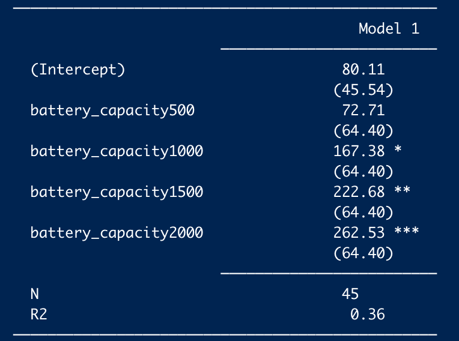

_Figure C_

Figure D. is the plotted results from Regression Model2 showing each battery capacities’ effect on average score.

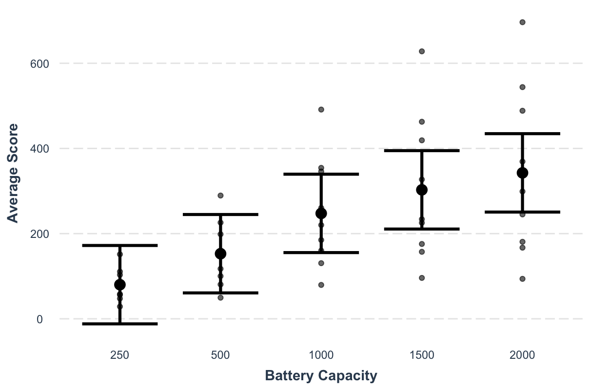

_Figure D_

 
